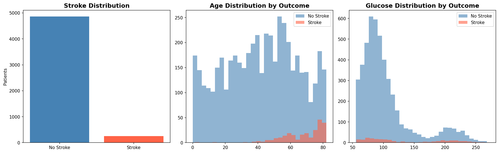

# 🧠 Stroke Risk Predictor
### Machine Learning Web Application for Stroke Risk Assessment


## 🚀 Live App
**👉 [Try it here](https://heart-disease-analysis-g2bscqhrqusscpbrduwywj.streamlit.app/)**

---

## 📌 Project Overview

This project builds a real-time stroke risk prediction web application using machine learning. 
The app has two interfaces — a simplified **public tool** where anyone can check their risk 
using basic information, and a full **clinical assessment tool** for healthcare professionals.

The project covers the complete data science pipeline: data cleaning, exploratory data analysis, 
handling class imbalance with SMOTE, model training, and deployment as a live web application.

---

## ❓ The Core Question

> *"Can we predict whether a patient is at risk of stroke based on their health 
> and lifestyle information — and make that prediction accessible to everyone?"*

---

## 📂 Project Structure

```
heart-disease-analysis/
│
├── data/
│   ├── healthcare-dataset-stroke-data.csv   # Raw dataset (never modified)
│   └── stroke_cleaned.csv                   # Cleaned dataset
│
├── notebooks/
│   └── data_cleaning.ipynb                  # Full cleaning and ML pipeline
│
├── outputs/
│   └── charts/                              # Saved visualisation plots
│
├── app.py                                   # Streamlit web application
├── requirements.txt                         # Python dependencies
└── README.md                                # This file
```

---

## 📊 Dataset

| Property      | Details                                                        |
|---------------|----------------------------------------------------------------|
| Source        | [Kaggle — Stroke Prediction Dataset](https://www.kaggle.com/datasets/fedesoriano/stroke-prediction-dataset) |
| Patients      | 5,110 patient records                                          |
| Features      | 11 attributes including age, BMI, glucose, smoking status      |
| Target        | `stroke` — 1 = Had Stroke, 0 = No Stroke                      |
| Class Balance | Severely imbalanced — only 4.9% stroke cases                  |

**Features:** gender, age, hypertension, heart\_disease, ever\_married, work\_type, 
Residence\_type, avg\_glucose\_level, bmi, smoking\_status

---

## 🔧 What I Did

### 1. Data Cleaning
- Dropped useless `id` column
- Found and filled 201 missing BMI values with column median
- Encoded 5 categorical text columns using Label Encoding
- Saved cleaned dataset to `data/stroke_cleaned.csv`

### 2. Exploratory Data Analysis
- Dataset is severely imbalanced — 4,861 healthy vs only 249 stroke patients
- Stroke patients are significantly older on average
- Higher glucose levels correlate strongly with stroke occurrence
- Visualised age and glucose distributions by outcome

### 3. Handling Class Imbalance with SMOTE
- Identified severe imbalance — model predicted "No Stroke" for every patient (0% recall)
- Applied SMOTE (Synthetic Minority Oversampling Technique) to balance training data
- Stroke cases increased from 187 to 3,901 in training set after SMOTE
- Stroke recall improved from 0% to 11% after balancing

### 4. Model Training
- Used Random Forest Classifier with `class_weight='balanced'`
- Applied 0.30 probability threshold instead of default 0.50 for better sensitivity
- Overall accuracy: 92%
- Model now detects stroke risk instead of ignoring minority class entirely

### 5. Web Application
- Built dual-interface Streamlit app
- Public page: calculates BMI automatically from weight and height
- Clinical page: full medical feature input for professionals
- Input validation — warns user if fields are left empty
- Deployed live on Streamlit Community Cloud

---

## 💡 Key Findings

- 🔍 **Class imbalance was the biggest challenge** — 95.1% of patients had no stroke, causing the model to predict "No Stroke" for everyone without SMOTE
- 🔍 **Age is the strongest predictor** — stroke patients were significantly older on average
- 🔍 **Glucose levels matter** — higher average glucose was consistently associated with stroke cases
- 🔍 **SMOTE transformed model behaviour** — stroke recall jumped from 0% to 11% after balancing
- 🔍 **Threshold tuning improved sensitivity** — lowering decision threshold from 0.50 to 0.30 makes the model more cautious in a medical context

---

## 🌐 App Features

### 👤 Quick Check (Public)
- Enter age, weight, height, gender and lifestyle info
- BMI calculated automatically from weight and height
- Simple language — no medical knowledge needed
- Instant risk score with clear result

### 🔬 Clinical Assessment
- Full medical feature input
- Direct glucose and BMI entry
- Detailed probability score
- Designed for healthcare professionals

---

## 📈 Sample Visualisations



---

## 🚀 How to Run Locally

1. **Clone the repository**
```bash
git clone https://github.com/tarun132006/heart-disease-analysis.git
cd heart-disease-analysis
```

2. **Install dependencies**
```bash
pip install -r requirements.txt
```

3. **Run the app**
```bash
streamlit run app.py
```

4. **Or just use the live version**
👉 [heart-disease-analysis.streamlit.app](https://heart-disease-analysis-g2bscqhrqusscpbrduwywj.streamlit.app/)

---

## 🛠️ Requirements

```
streamlit
pandas
numpy
scikit-learn
imbalanced-learn
```

---

## 👤 Author

**Tarun**
- GitHub: [@tarun132006](https://github.com/tarun132006)

---

## ⚠️ Disclaimer

This application is for educational purposes only and is not a substitute for 
professional medical advice, diagnosis, or treatment. Always consult a qualified 
healthcare professional for medical concerns.

---

## 📜 License

This project is open source and available under the [MIT License](LICENSE).

---

*Dataset sourced from Kaggle — Stroke Prediction Dataset by fedesoriano.*